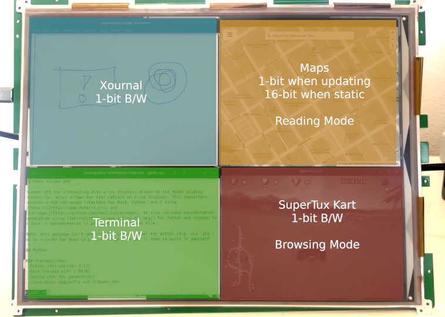

# Modos Glider API

Common API for interacting with e-ink displays driven by the Modos display
controller, which allows for fast refresh of e-ink displays. This repository
exposes a USB HID-based interface for Rust, Python, and C using 
[maturin](https://www.maturin.rs/) and 
[cbindgen](https://github.com/mozilla/cbindgen). It also includes documentation
generation using [Sphinx](https://www.sphinx-doc.org/) for Python and rustdoc for Rust. C documentation is provided in the header file.

Here's a short video showing the SDK in action, setting different refresh modes for different sections of the screen:

[](https://www.youtube.com/watch?v=AoDYEZE7gDA)



Note: this package isn't yet installable as a wheel for python (e.g. via `pip`)
or as a crate for Rust (e.g. via `cargo`) so you'll need to build it yourself.

## Python 

### Prerequisites:
- Python (min version 3.12)
- Rust (tested with 1.89.0)
- Sphinx (for doc generation)
- Linux only: pkgconfig and libudev-dev

To install the API, clone this directory and run:
```shell
cd glider-api
pip install .
```

To generate the documentation, you'll need to set up a virtual environment with `glider-api` installed, and then run one of the Sphinx `make` options:
```shell
python -m venv ./venv
./venv/scripts/activate # or `source venv/bin/activate`
pip install maturin
pip install myst-parser
maturin develop
make html
```

For Windows, replace the second command with `.\venv\scripts\activate.bat` and the final command with `.\make.bat html`.

## Rust and C

### Prerequisites:
- Rust (tested with 1.89.0)

To create the Rust library and its C bindings, simply run `cargo build`. 

To generate Rust documentation, simply run `cargo doc`.

## Linux Permissions

By default, most Linux distributions require extended permission to access HID devices (e.g. `/dev/hiidraw*`). For development purposes, it's fine to set the permissions for your Modos device directly, e.g. `sudo chmod 0666 /dev/hidraw7`, however for a more complete solution, you'll need to configure `udev` to allow access to your device. For more information, check out the [udev documentation](https://www.kernel.org/pub/linux/utils/kernel/hotplug/udev/udev.html) and [this StackExchange post](https://askubuntu.com/questions/15570/configure-udev-to-change-permissions-on-usb-hid-device).

## Contributing and Community

For help with glider-api, or to get involved with contributing to the project, come join us on our [Discord](https://discord.gg/6ktE6VxSyh).
